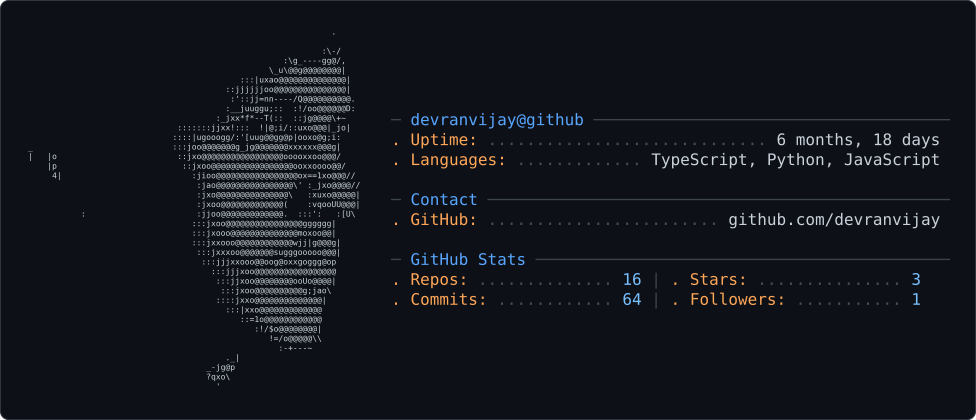

<div align="center">


<a href="https://github.com/devranvijay">
  
</a>

<br/>


</div>


## Summary

Data Analyst repositioning into **Data Engineering & AI Automation Engineering**, with hands-on experience building ETL/ELT pipelines, data warehouses, and LLM-powered automation across healthcare and FMCG.

- Reduced reporting turnaround by **67%** (3 days → 1 day)
- Automated **15+** business-critical workflows
- Shipped an end-to-end AI document-processing pipeline
- Working daily in **Python, SQL, GCP (BigQuery, Cloud Composer, Pub/Sub)** and **Gemini-based LLM automation**

<br/>

## Stack

<div align="center">


</div>

| Category | Tools |
|---|---|
| **Languages** | Python (Pandas, NumPy, pytest), SQL (CTEs, window functions), Shell, JavaScript |
| **AI & Automation** | Gemini API, Prompt Engineering, RPA (Python, Apps Script), FastAPI, REST APIs |
| **Data Engineering** | ETL/ELT design, dbt, Dimensional Modeling (Star Schema), Data Quality & Validation, Data Migration |
| **Cloud & DevOps** | GCP (BigQuery, Cloud Composer/Airflow, Dataflow, Cloud Functions, Pub/Sub), AWS (EC2, S3), Docker, Kubernetes, GitHub Actions |
| **Databases** | PostgreSQL, MySQL, BigQuery, Oracle, MongoDB, Redis, DuckDB |
| **Visualization** | Looker Studio, Power BI, Tableau, Metabase |

<br/>

## Experience

```
2026 — Present   Data Analyst · Haitech Medical Solutions, Mumbai
                  → Automated ETL pipelines consolidating CRM/ERP/field-sales
                    data into a centralized PostgreSQL warehouse
                  → Star-schema modeling + optimized SQL for pricing &
                    demand-planning analytics
                  → Data quality frameworks + document-extraction automation
                    (PDF/DOCX → reporting-ready data)

2024 — 2026      Data Analyst · Brownwall Food Pvt Ltd, Mumbai
                  → Cut reporting TAT 67% via validated ETL pipelines
                  → Shipped 5+ live Looker Studio dashboards for exec reporting
                  → Automated 15+ workflows (Python + Apps Script), -40% manual effort
                  → Built internal CRM on AWS EC2/S3 + Redis (+30% query perf),
                    zero-loss legacy data migration
```

<br/>

## Featured Projects

<table>
<tr>
<td width="33%" valign="top">

**BlinkPipe**
Full data engineering pipeline for quick-commerce analytics — MinIO lake → Airflow ETL → dbt star schema → DuckDB → Metabase, fully containerized.

`Python` `Airflow` `dbt` `DuckDB` `Docker`

</td>
<td width="33%" valign="top">

**RAG Drive FAQ Agent**
n8n workflow that answers questions over Google Drive files. Auto-chunks & embeds via Gemini Embeddings into Pinecone; agent retrieves + generates grounded answers.

`n8n` `Gemini API` `Pinecone`

</td>
<td width="33%" valign="top">

**Superstore Analytics**
Interactive Power BI dashboard surfacing top regions/products from retail sales data, with DAX-modeled KPIs and YoY trend mapping.

`Power BI` `DAX` `Power Query`

</td>
</tr>
</table>

<br/>


## Education & Certifications

- **B.Sc. Computer Science** — R.J. College of Arts, Science & Commerce, Mumbai · CGPA 8.64/10 (2021–2024)
- Advanced Data Analytics — Certification
- 100 Days of Code: The Complete Python Pro Bootcamp — Dr. Angela Yu (Udemy)

<br/>

<div align="center">

[](https://linkedin.com/in/ranvijay46)
[](mailto:ranvijay3325778@gmail.com)
[](https://github.com/devranvijay)

</div>


