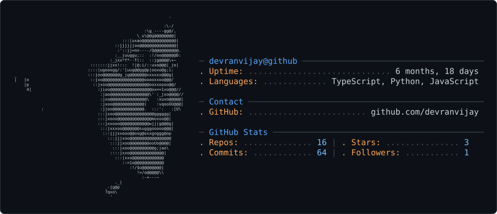

 

---

# Hi, I'm Ranvijay Singh 👋

### Data Analyst • Data Science & AI Automation Engineer

I'm a Data Analyst transitioning into **Data Science & AI Automation**, with hands-on experience in building ETL pipelines, analytics dashboards, AI-powered document processing, and business workflow automation across healthcare and FMCG domains.

- 📊 Reduced reporting turnaround by **67%** (3 days → 1 day)
- 🤖 Automated **15+** business-critical workflows
- 🧠 Built LLM-powered document extraction & RAG solutions
- ☁️ Working with **Python, SQL, GCP, BigQuery & Scikit-learn**

---

## Tech Stack

| Category | Technologies |
|------------|--------------|
| **Languages** | Python, SQL, JavaScript |
| **Data Science** | Pandas, NumPy, Scikit-learn, Matplotlib, Jupyter Notebook |
| **AI & Automation** | Gemini API, Prompt Engineering, FastAPI, Google Apps Script, REST APIs |
| **Data Engineering** | ETL/ELT Pipelines, dbt, Star Schema, Data Validation, BigQuery |
| **Cloud** | GCP (BigQuery, Cloud Composer, Pub/Sub), AWS (EC2, S3), Docker |
| **Databases** | PostgreSQL, MySQL, MongoDB, DuckDB |
| **Visualization** | Power BI, Looker Studio, Tableau, DAX |

---

## Experience

### Data Analyst • Haitech Medical Solutions *(2026 – Present)*

- Built ETL pipelines integrating CRM, ERP and field-sales data into PostgreSQL
- Designed star-schema warehouse for pricing & demand analytics
- Developed AI document extraction pipeline (PDF/DOCX → structured data)
- Improved data quality through automated validation workflows

### Data Analyst • Brownwall Food Pvt Ltd *(2024 – 2026)*

- Reduced reporting TAT by **67%** using automated ETL pipelines
- Developed **5+** executive dashboards in Looker Studio
- Automated **15+** operational workflows with Python & Apps Script
- Built internal CRM and migrated legacy business data with zero data loss

---

## Featured Projects

### 🚀 BlinkPipe — Data Engineering Pipeline

End-to-end analytics platform for quick-commerce data.

**Tech:** Python • Airflow • dbt • DuckDB • Docker

---

### 🤖 RAG Drive FAQ Agent

LLM-powered knowledge assistant over Google Drive documents using semantic search.

**Tech:** n8n • Gemini API • Pinecone

---

### 📈 Superstore Analytics Dashboard

Interactive Power BI dashboard with KPI tracking, DAX measures and regional sales analysis.

**Tech:** Power BI • DAX • Power Query

---

## Education

**M.Sc. Data Science & Artificial Intelligence** *(2026 – Present)*

**B.Sc. Computer Science** — R.J. College, Mumbai

**CGPA:** 8.64 / 10

---

## Certifications

- Advanced Data Analytics
- 100 Days of Code: Python Bootcamp — Dr. Angela Yu

---

## Connect With Me

